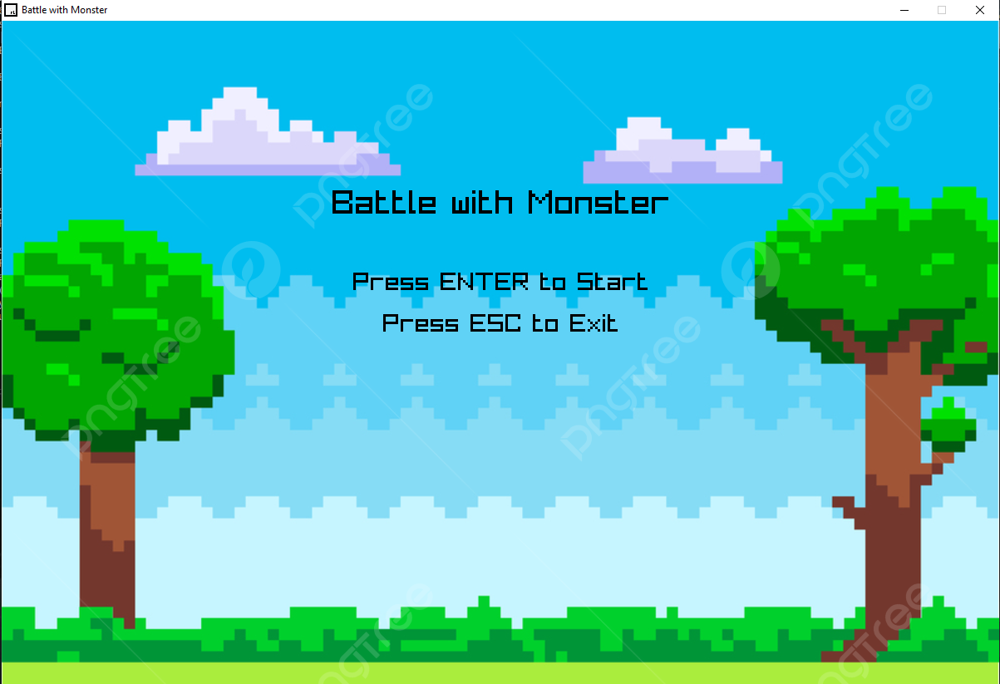

# Практическая работа №7. Графическая мини-игра "Битва с монстром"

## Описание проекта

Данный проект является практической работой по программированию на C++ с использованием библиотеки Raylib. Реализована 2D-графическая игра "Битва с монстром", демонстрирующая работу с графикой, обработкой пользовательского ввода, системой боя, звуковыми эффектами и интерфейсом. Игрок управляет персонажем, сражающимся с монстром, с возможностью собирать бонусы и отслеживать очки.

## Мини-игра: "Битва с монстром"

### Описание

Игрок управляет персонажем, передвигающимся по экрану с помощью клавиш стрелок, и сражается с монстром, который преследует его. При столкновении игрок может атаковать монстра клавишей 'SPACE'. У персонажей есть здоровье, а после победы над монстром появляется новый. Игрок может собирать аптечки для восстановления здоровья. Игра включает главное меню, паузу и экран окончания игры.

### Функциональность

- Главное меню с кнопками "Начать игру" (ENTER) и "Выход" (ESC).
- Управление персонажем с помощью клавиш стрелок и атака клавишей 'SPACE'.
- Монстр преследует игрока и наносит урон при столкновении.
- Система боя с параметрами здоровья и задержкой атак.
- Появление аптечек для восстановления здоровья игрока.
- Автоматическое появление нового монстра после победы.
- Экран паузы (клавиша 'P') с возможностью продолжения или возврата в меню.
- Экран окончания игры с отображением финального счета и возможностью перезапуска.
- Звуковые эффекты для атак и фоновая музыка.
- Отображение здоровья игрока, монстра и счета на экране.
- Графическая отрисовка фона, спрайтов персонажей и аптечек.

### Скриншоты

